# 三、简答题（23题）

### Q1. 简述DNA复制的三种方式（类型）

**答案：**

DNA复制有三种方式：

**1. 双向复制（Bidirectional replication）：** 两个复制叉从复制起点（ORI）同时向相反方向移动。原核生物的环状染色体在单一复制起点开始，向两个方向进行；真核生物线性染色体含有多个复制起点，每个起点同样进行双向复制，形成前导链和滞后链。

**2. 单向复制（Unidirectional replication）：** 只有一个复制叉从起点向一个方向移动。例如大肠杆菌的质粒colE1，含有一个ORI，复制以单向方式进行。

**3. 滚环复制（Rolling circle replication）：** 环状双链DNA中的一条链被内切酶切开产生切口，以完整链为模板，切口处的3'-端不断延伸。完成一轮复制后，释放出一条全长的单链环状DNA。此方式又称σ模型，见于ΦX174等单链环状DNA噬菌体。

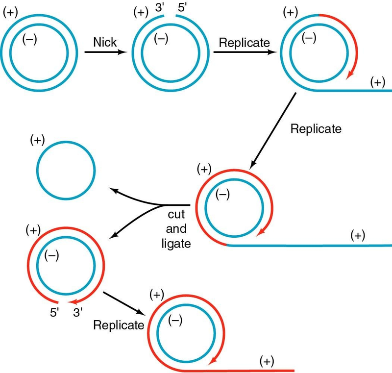

**来源：** MB6-DNA-replication-mzhou, 第47-54页

---

### Q2. 简述mRNA剪接（splicing）的过程

**答案：**

mRNA剪接是指将未成熟RNA中的内含子（intron）切除，并将外显子（exon）连接起来形成成熟mRNA的过程。剪接发生在剪接体（spliceosome）上，剪接体由snRNA（U1、U2、U4、U5、U6）和蛋白质（snRNPs）组成。

剪接过程分为**两步转酯反应**：

**第一步：** 位于内含子分支点（branch point）的腺苷酸（A）的2'-羟基攻击5'外显子/内含子边界的磷酸二酯键，使5'外显子被释放，同时内含子形成套索（lariat）结构。
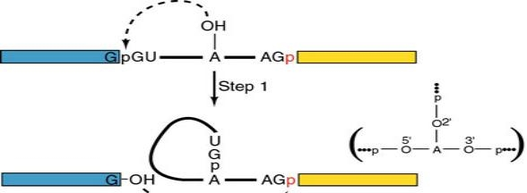
**第二步：** 5'外显子的3'端攻击3'内含子/外显子边界的磷酸二酯键，将两个外显子连接在一起，同时内含子以套索形式被释放。
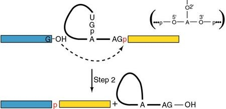
**剪接信号特征：** 内含子前两个碱基为GU，最后两个碱基为AG。哺乳动物共有序列为：AG|GUAAGU -- 内含子 -- YNCURAC -- YnNAG|G，其中Y为嘧啶，R为嘌呤，N为任意碱基，A为分支点。

**各snRNP的功能：** U1通过碱基配对识别5'剪接位点；U2与分支点保守序列碱基配对；U5连接两个外显子的最后一个和第一个核苷酸，使两个外显子对齐；U6与内含子5'端结合，并与U2配对形成关键结构；U4与U6配对，在U6被需要参与剪接反应之前与U6结合。

**来源：** MB11(8), 第4-27页

---

### Q3. 简述miRNA的合成过程

**答案：**

miRNA的合成过程包括以下步骤：

**1. 转录生成pri-miRNA：** miRNA从内源基因转录，产生初级miRNA（pri-miRNA），其序列较长，含有多个茎环（hairpin）结构，内部序列互补不完美（imperfect complementarity）。

**2. 细胞核内加工为pre-miRNA：** pri-miRNA被RNase III型酶Drosha识别（Drosha对茎环结构具有高亲和力），在细胞核内被切割加工成约70个核苷酸的发夹状前体miRNA（pre-miRNA）。

**3. 转运至细胞质：** pre-miRNA通过Exportin 5转运蛋白从细胞核输出到细胞质。

**4. 细胞质内加工为成熟miRNA：** pre-miRNA在细胞质中被Dicer酶切割，生成成熟的miRNA（约21-24个核苷酸），具有对称的2nt 3'突出端和5'磷酸基团。

**5. 形成RISC复合物发挥功能：** 成熟miRNA装载到RISC（RNA诱导沉默复合体）上，通过碱基互补配对靶向mRNA，主要导致翻译抑制（translational repression），也可能导致mRNA切割。

**来源：** MB12(9), 第40-43页

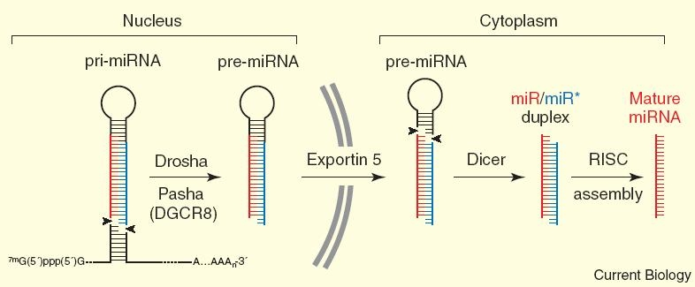
---

### Q4. 什么是加帽（capping）？有哪几种类型及其生物学作用？

**答案：**

**加帽（Capping）** 是指在mRNA的5'端通过5'-5'三磷酸连接加上一个甲基化鸟苷酸（methylated guanosine）的过程，发生在细胞核中。

**三种类型：**
- **Cap 0型**：7-甲基鸟苷（m7G），缺乏2'-O-甲基化修饰。
- **Cap 1型**：7-甲基化鸟嘌呤加上第一个碱基的核糖上有一个2'-O-甲基。
- **Cap 2型**：7-甲基化鸟嘌呤加上第一个和第二个碱基的核糖上各有2'-O-甲基。

**加帽的合成过程（四步）：**
1. 去除pre-mRNA 5'端第一个碱基的γ-磷酸基团；
2. 鸟苷酸转移酶（guanylyl transferase）将GTP的GMP部分加上，形成三磷酸连接；
3. 帽结构的鸟嘌呤残基在N7位置被甲基化；
4. 其他甲基转移酶在后续核苷酸核糖的2'-OH上添加甲基。

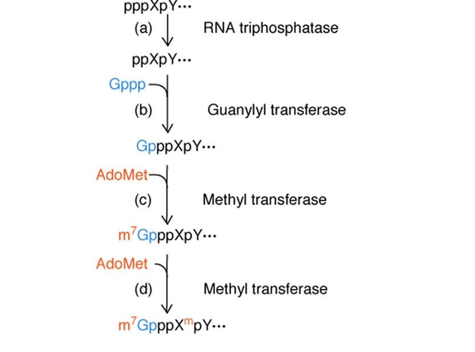

**生物学作用：**
1. 保护RNA免受降解（Protection of the RNA from degradation）；
2. 增强mRNA的可翻译性，提高翻译效率；
3. 促进mRNA从细胞核转运到细胞质；
4. 促进pre-mRNA的正确剪接。

**来源：** MB11(8), 第40-43页

---

### Q5. 根据给定图形中核苷酸链的不同化学键（磷酸二酯键、糖苷键、氢键），写出对应水解酶的名称及区别

**答案：**

**1. 磷酸二酯键（Phosphodiester bond）：**
- **水解酶：核酸酶（Nuclease）**，包括DNA酶（DNase）和RNA酶（RNase），以及DNA聚合酶I具有的5'→3'和3'→5'外切核酸酶活性。
- 作用：切割DNA/RNA骨架中连接相邻核苷酸的磷酸二酯键。DNA聚合酶I的5'→3'外切酶活性在复制过程中负责切除RNA引物；MNase可切割核小体之间的连接DNA。

**2. 糖苷键（Glycosidic bond）：**
- **水解酶：N-糖苷酶（N-glycosidase）/ DNA糖苷酶（DNA glycosylase）。**
- 作用：切割碱基与脱氧核糖之间的N-糖苷键，在DNA修复中切除损伤碱基。
- *说明：课件中未找到关于糖苷酶的直接内容。*

**3. 氢键（Hydrogen bond）：**
- **解链酶：DNA解旋酶（DNA Helicase，如DnaB蛋白）。**
- 作用：利用ATP水解提供的化学能，将复制叉处的双链DNA解开，打断互补碱基对之间的氢键。

**三种酶的核心区别：**

| 酶类 | 断裂的键 | 键的类型 | 是否需要ATP |
|------|----------|----------|------------|
| 核酸酶 | 磷酸二酯键 | 共价键 | 否 |
| N-糖苷酶 | 糖苷键 | 共价键 | 否 |
| DNA解旋酶 | 氢键 | 非共价键 | 是 |

**来源：** MB6-DNA-replication-mzhou, 第19-21页（解旋酶）、第15页和第32-33页（核酸酶）；MB2-2026, 第14页（磷酸二酯键结构）；MB3-2026, 第32页（MNase切割连接DNA）

---

### Q6. 简述Class II转录起始前复合体（preinitiation complex）的装配过程

**答案：**

Class II转录起始前复合体（PIC）是RNA聚合酶II和通用转录因子（general transcription factors）在启动子处组装形成的复合物，在转录开始之前装配完成。

**装配顺序（四步）：**
1. 在TFIIA的帮助下，TFIID结合到TATA box上（TFIID是最重要的通用转录因子，包含一个TATA-box结合蛋白TBP和8-10个TBP相关因子TAFIIs）。
2. TFIIB随后结合，发生蛋白质-DNA相互作用。
3. TFIIF帮助RNA聚合酶II结合到-34到+17区域（TFIIF对RNA聚合酶的结合至关重要）。
4. 剩余的转录因子TFIIE和TFIIH结合，完成前起始复合体的装配。

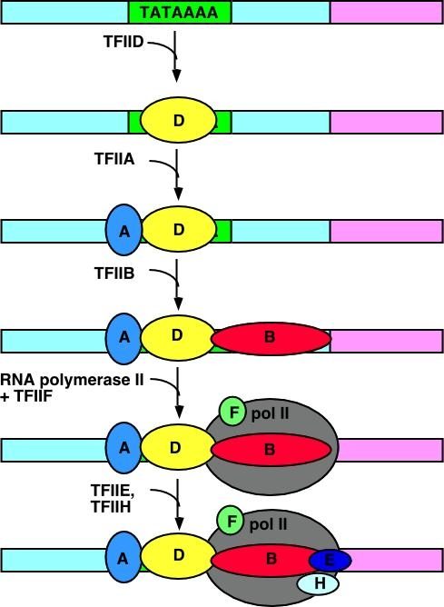

整个前起始复合体结合在启动子的TATA box区域。TBP与TATA box的小沟（minor groove）结合，形成一个"马鞍"状结构，使DNA弯曲约80度。

**来源：** MB8-Transcription in eu-mzhou, 第36-40页

---

### Q7. 除Pol I、II、III之外，还有哪些RNA聚合酶？各有什么作用？

**答案：**

在植物中，除Pol I、II、III之外，还存在两种额外的RNA聚合酶：

**1. RNA聚合酶IV（Pol IV）：** 负责合成siRNA，这些siRNA作用于染色质区域（chromatin regions），参与基因沉默。

**2. RNA聚合酶V（Pol V）：** 负责合成长链非编码RNA（long noncoding RNA），这些lncRNA吸引siRNA-AGO4复合物到目标区域，实现基因沉默。

Pol IV和Pol V在进化上均由RNA聚合酶II衍生而来（evolutionarily derived from RNA polymerase II）。

**来源：** MB8-Transcription in eu-mzhou, 第9页

---

### Q8. 真核生物和原核生物的翻译起始过程有什么不同？

**答案：**

| 比较项目 | 原核生物 | 真核生物 |
|---------|---------|----------|
| 起始氨基酸 | N-甲酰甲硫氨酸（fMet） | 甲硫氨酸（Met） |
| mRNA识别机制 | 依赖SD序列（AGGAGGU）与16S rRNA 3'端互补配对 | 无SD序列；40S小亚基识别5'帽子，沿mRNA扫描至第一个AUG |
| 核糖体亚基 | 30S + 50S = 70S | 40S + 60S = 80S |
| 起始因子 | IF1、IF2、IF3三种 | 大量eIF（eIF2, eIF3, eIF4F, eIF5等），更为复杂 |

**原核翻译起始（6步）：**
1. IF-1促进70S核糖体解离为30S和50S亚基
2. IF-3结合到30S亚基，阻止亚基重新结合
3. IF-1和IF-2/GTP结合到30S亚基
4. 通过SD序列与16S rRNA配对，30S与fMet-tRNA和mRNA结合形成30S起始复合物
5. 50S亚基结合到30S复合物，IF-1和IF-3释放
6. IF-2上的GTP水解为GDP+Pi，IF-2释放，形成70S起始复合物

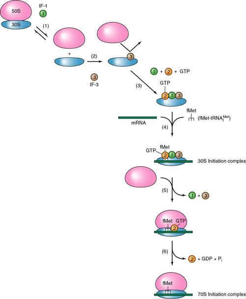

**真核翻译起始：**
1. 40S亚基与eIF-3结合形成40SN结构
2. 在eIF-2帮助下，起始tRNA加入形成43S复合物
3. 在eIF-4帮助下结合到mRNA的5'帽子端形成48S起始复合物
4. 复合物沿mRNA扫描至正确的AUG起始密码子（扫描由eIF4A ATP依赖性解旋酶促进）
5. 在eIF-5帮助下，60S亚基加入形成80S起始复合物

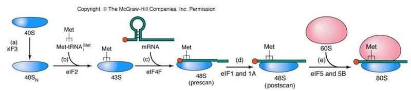

**来源：** MB13(7), 第32-42页

---

### Q9. 简述原核生物30S起始复合物（30S initiation complex）的装配步骤

**答案：**

**第一步：核糖体亚基解离**
在每轮翻译结束时，70S核糖体解离为30S和50S亚基。IF1和IF3共同促进这一解离过程。IF3结合到游离的30S亚基上，阻止其与50S亚基重新结合。

**第二步：起始因子结合到30S亚基**
IF3首先单独结合到30S亚基上；IF1和IF2稳定这种结合。IF2可以在IF1和IF3的帮助下稳定结合。GTP也是IF2在生理浓度下结合所必需的，但GTP在此过程中不被水解。

**第三步：mRNA结合到30S亚基**
mRNA通过Shine-Dalgarno序列（SD序列，保守序列为AGGAGGU，位于起始密码子上游约10nt）与16S rRNA的3'端互补序列进行碱基配对，从而结合到30S亚基上。这一结合过程由IF3介导，并受IF1和IF2的辅助。

**第四步：fMet-tRNA结合**
IF2是促进fMet-tRNA结合到30S起始复合物的主要因子，IF1和IF3也起重要的辅助作用。起始密码子通常为AUG（也可以是GUG，少数情况为UUG），起始氨酰tRNA为N-甲酰甲硫氨酰-tRNA（fMet-tRNA）。

**完整的30S起始复合物包含：** 30S核糖体亚基（一个）、mRNA、fMet-tRNA、GTP、以及起始因子IF1、IF2、IF3各一个。

**来源：** MB13(7), 第23-32页

---

### Q10. 翻译过程中需要哪几种RNA？分别说出其生物学功能

**答案：**

翻译过程中需要以下三种RNA：

**1. mRNA（信使RNA）——作为模板：** mRNA携带来自DNA的遗传信息，其上的三联体密码子（codon）序列决定了蛋白质中氨基酸的顺序。核糖体沿mRNA从5'到3'方向读取密码子。

**2. tRNA（转运RNA）——作为接头分子：** tRNA充当适配器分子（adapter molecule），一端通过反密码子（anticodon）与mRNA上的密码子互补配对，另一端通过3'端CCA携带相应的氨基酸。氨酰tRNA合成酶催化tRNA与氨基酸的结合（tRNA charging）。

**3. rRNA（核糖体RNA）——结构和催化功能：** rRNA是核糖体的主要结构和功能组分。rRNA将mRNA和tRNA固定在正确的位置上，并且核糖体的蛋白质部分和rRNA共同催化肽键的形成（肽基转移酶活性）。rRNA还参与SD序列与mRNA的配对识别（如原核生物16S rRNA的3'端与mRNA的SD序列互补）。

**来源：** MB13(7), 第3-4页、第14页、第25-26页

---

### Q11. 简述三种检测DNA与蛋白质相互作用的技术

**答案：**

**(1) 酵母单杂交系统（Yeast One-Hybrid System）：** 使用报告载体（含目标DNA元件融合到GAL4最小启动子前）和AD载体（含编码潜在转录因子的cDNA融合到GAL4转录因子）。如果cDNA编码的蛋白与目标DNA元件结合，GAL4转录因子将启动报告基因转录。属于in vivo检测方法。

**(2) 凝胶迁移滞后实验（EMSA, Electromobility Shift Assay）：** 将裸DNA与蛋白共同孵育后进行非变性凝胶电泳。如果蛋白与DNA结合，DNA-蛋白复合物的分子量增大，在凝胶中的迁移速率会慢于裸DNA（发生迁移滞后）。属于in vitro检测方法。

**(3) 染色质免疫共沉淀（ChIP, Chromatin Immuno Precipitation）：** 在活细胞内用甲醛将蛋白与DNA交联，超声剪切DNA，用特异性抗体免疫沉淀目标蛋白-DNA复合物，逆转交联后检测富集的DNA片段。步骤：交联→剪切→预清除→加抗体→免疫沉淀→逆转交联→检测。属于in vivo方法。

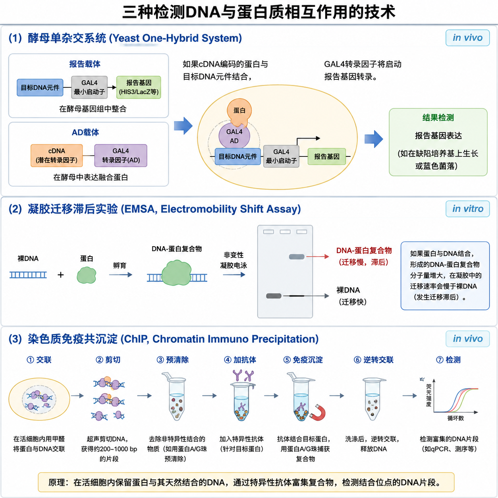

**来源：** MB5-2026, 第60-67页

---

### Q12. 列举并简述三种检测蛋白质与蛋白质相互作用的技术

**答案：**

**(1) 酵母双杂交系统（Yeast Two-Hybrid System, Y2H）：** 利用真核转录因子的组件式结构特征——DNA结合结构域（BD）和转录激活结构域（AD）分离时均不能激活转录。将诱饵蛋白与BD融合、猎物蛋白与AD融合，在酵母中共表达。若两者互作，BD和AD在空间上靠近，恢复转录激活功能，驱动报告基因表达。属于in vivo方法。

**(2) 免疫共沉淀（Co-Immunoprecipitation, Co-IP）：** 将靶蛋白的抗体连接到固体基质（如Protein A/G beads）上，通过抗体-靶蛋白-相互作用蛋白的复合物共同沉淀。可用于in vivo或in vitro检测。

**(3) 双分子荧光互补（Bimolecular Fluorescence Complementation, BiFC）：** 将荧光蛋白拆分为两个无活性的N端和C端片段，分别融合到两个待测蛋白上；若两个蛋白发生相互作用，荧光蛋白的两个片段在空间上靠近，重新折叠组装成有活性的荧光蛋白，产生荧光信号，可在活细胞内直观地可视化蛋白质相互作用。属于in vivo方法。

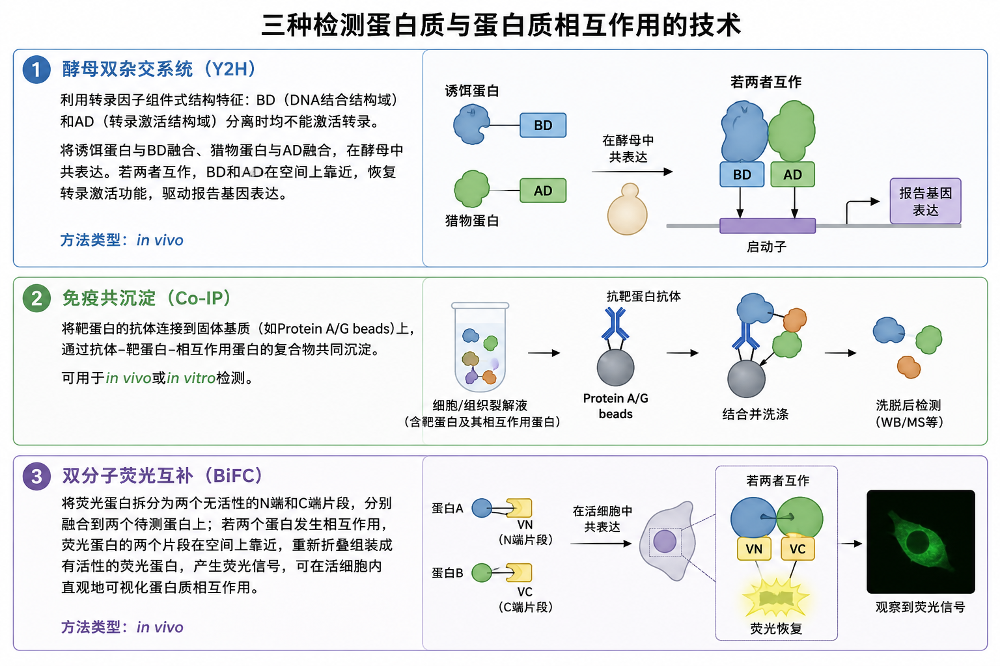

*（课件另提及：GST Pull-down、Far Western印迹、蛋白质芯片、表面等离子共振SPR、荧光共振能量转移FRET等）*

**来源：** MB5-2026, 第89页; MB15(5), 第75-78页

---

### Q13. 简述酵母双杂交（Y2H）系统的基本操作步骤

**答案：**

酵母双杂交系统基于真核转录调控因子的组件式结构特征：BD和AD分离时均不能激活转录，但由不同蛋白的BD和AD形成的杂合蛋白能激活转录。

**基本操作步骤：**

1. **构建诱饵载体（Bait）：** 将感兴趣的蛋白X的编码序列与GAL4的DNA结合结构域（BD）融合，克隆入酵母表达载体。
2. **构建猎物载体（Prey）：** 将待筛选的蛋白Y的cDNA（或cDNA文库）与GAL4的转录激活结构域（AD）融合，克隆入另一酵母表达载体。
3. **共转化酵母：** 将两种融合载体共同转化至含报告基因的酵母菌株中。报告基因（如LacZ、HIS3、ADE2等）的表达受GAL4结合位点控制。
4. **选择性培养筛选：** 涂布于选择性缺陷培养基（如sc-leu-trp-his-ade）上。若两个蛋白互作，BD和AD重新形成有功能的转录因子，激活报告基因表达，酵母能在缺陷培养基上生长并变蓝。
5. **验证阳性克隆：** 对阳性克隆进行测序鉴定，设置阳性对照（如T抗原+p53）和阴性对照（如T抗原+Lamin）以确保实验结果可靠。

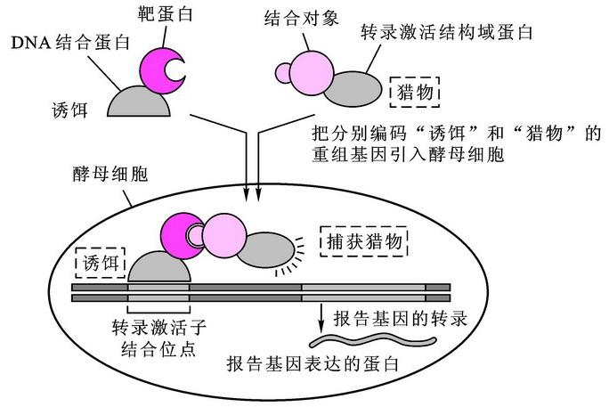

**来源：** MB5-2026, 第76-80页; MB15(5), 第75-78页

---

### Q14. 简述三种能够改变蛋白质活性的修饰方式

**答案：**

**(1) 磷酸化（Phosphorylation）：** 由蛋白激酶在丝氨酸、苏氨酸或酪氨酸残基上添加磷酸基团，由蛋白磷酸酶去除。例如：DNA损伤条件下，蛋白激酶ATM使p53磷酸化，磷酸化的p53变得稳定并快速积累，进而激活下游基因转录，引发细胞凋亡或DNA修复。翻译起始因子eIF2α的磷酸化可抑制翻译起始。

**(2) 乙酰化（Acetylation）：** 由组蛋白乙酰转移酶（HATs，如CBP、p300、GCN5等）在赖氨酸残基上添加乙酰基，由组蛋白去乙酰化酶（HDACs）去除。乙酰化不仅作用于组蛋白（降低组蛋白的抑制活性，与转录活跃相关），也可作用于非组蛋白的激活因子和抑制因子。

**(3) 泛素化（Ubiquitination）：** 转录因子等蛋白可被小蛋白泛素（ubiquitin）修饰。单泛素化对某些激活因子具有激活效应，但多聚泛素化则标记该蛋白进行降解。泛素化由泛素结合酶Rad6/连接酶Bre1等介导。

*（此外还有SUMO化、甲基化和糖基化等修饰方式）*

**来源：** MB9-Transcription-control-in-eu-mzhou, 第36-46页；MB13(7), 第60-65页；MB15(5), 第97页；MB16(7), 第32-35页

---

### Q15. 简述将目的基因导入质粒的三种方法

**答案：**

**(1) 传统限制性内切酶-连接酶法：** 用相同的限制性内切酶分别切割目的基因和载体质粒，产生相同的粘性末端或平末端。将两者混合后用T4 DNA连接酶连接。为防止载体自连，可用碱性磷酸酶去除载体5'-磷酸基团。最后通过转化导入宿主细胞。

**(2) 无缝克隆/同源重组法（Seamless DNA Cloning）：** 利用同源重组原理，不需要依赖限制性内切酶切位点。在目的基因片段两端设计与载体线性化末端具有20bp以上同源序列的引物进行PCR扩增，然后用重组酶介导同源重组，将插入片段定向克隆至载体的任意位置。优点：不需限制性酶切、不需磷酸酶处理、不增加或删除核苷酸（无缝）、可实现多片段一步定向克隆。

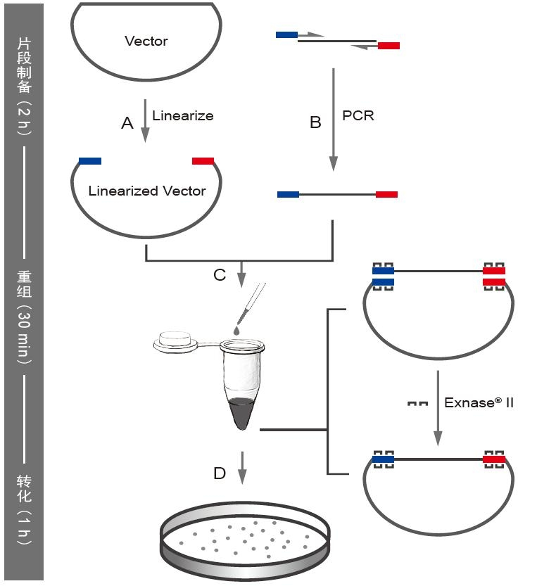

**(3) 定向克隆法（Directional Cloning）：** 使用两种不同的限制性内切酶分别切割载体和目的基因的两端，产生两种不同的粘性末端，确保目的基因以正确的方向插入载体，避免反向插入，提高克隆效率。

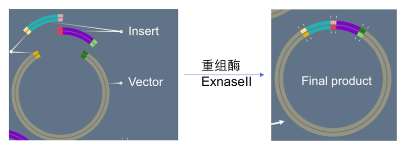

**来源：** MB4-2026, 第43页、第58页、第64-66页

---

### Q16. 给出3种在反向遗传学中获得基因功能丧失（loss of function）的方法

**答案：**

**(1) 基因特异性敲除（Gene-specific Knockout）与定点突变：** 通过同源重组将外源DNA（如含neo基因）插入靶基因的关键外显子中，破坏基因功能。在动物中通过胚胎干细胞（ES细胞）技术实现基因打靶；在植物中利用T-DNA插入失活实现。定点突变则通过改变特定位点的核苷酸序列来破坏蛋白功能。

**(2) RNA干扰（RNAi）/人工miRNA：** 由双链RNA（dsRNA）介导同源mRNA的高效特异性降解。dsRNA被Dicer酶切割成21-25 nt的siRNA，siRNA引导链与RISC复合物中的Ago2蛋白结合，通过碱基互补配对识别靶mRNA并切割降解（PTGS）。也可使用人工miRNA实现类似效果。

**(3) CRISPR/Cas9基因组编辑技术：** 通过设计单链引导RNA（sgRNA）特异识别靶基因序列，引导Cas9核酸酶切割靶基因的双链，产生双链断裂（DSB）。细胞通过非同源末端连接（NHEJ）修复DSB，可能产生Indel造成移码突变和基因功能丧失。

*（另：反义RNA技术、TALEN技术）*

**来源：** MB15(5), 第37-41页、第28-35页; MB5-2026, 第17-55页

---

### Q17. 在基因表达载体中加入tags（标签）有什么作用？

**答案：**

**(1) 易于纯化融合蛋白：** 表达载体产生的融合蛋白含有额外的氨基酸序列（标签），可利用亲和层析法（Affinity Chromatography）方便地纯化。例如，6×His tag可利用镍亲和层析纯化——组氨酸与镍离子有高亲和力，融合蛋白被特异性吸附到镍柱上，用咪唑洗脱获得纯化蛋白。

**(2) 便于检测与鉴定：** 标签可被特异性抗体识别，通过Western blot或免疫荧光等方法检测融合蛋白的表达情况、定位和表达量，无需针对每个目的蛋白制备特异性抗体。

**(3) 增加蛋白稳定性与可溶性：** 某些标签（如GST、MBP等）可以帮助提高融合蛋白的可溶性和稳定性，防止包涵体形成，有利于蛋白的正确折叠。

**来源：** MB4-2026, 第70页（融合蛋白与亲和层析）、第79页

---

### Q18. 植物细胞转入质粒常用的细菌是什么？需要用到哪个相关片段？

**答案：**

**常用细菌：** 根癌农杆菌（*Agrobacterium tumefaciens*）

**相关片段：** T-DNA（转移DNA）及其边界序列（T-DNA borders，包括左边界Left Border和右边界Right Border）。

**原理：** 农杆菌含有Ti质粒（Tumor-inducing plasmid），其上的T-DNA区域可整合入植物基因组。基因工程中使用改造的双元质粒系统：
- **双元载体（Binary plasmid）：** 去除致瘤基因的卸甲Ti质粒，在T-DNA边界序列之间放置目的基因（GOI）、多克隆位点（MCS）和植物筛选标记基因。
- **辅助质粒（Helper plasmid）：** 含有vir基因，编码的Vir蛋白负责识别T-DNA边界序列并将T-DNA区域切出、转运并整合入植物基因组。

当植物受伤时释放的乙酰丁香酮（AS）等酚类化合物可激活vir基因表达，启动T-DNA的加工和转移过程。

**来源：** MB4-2026, 第72-78页

---

### Q19. 简述着丝粒（centromere）的三个特点/功能

**答案：**

着丝粒是染色体上的一个缢缩区域（constricted region），具有以下三个特点/功能：

**1. 染色体分离装置（Segregation device）：** 着丝粒包含动粒（kinetochore）——一个特殊的蛋白质复合体，锁定在微管末端。在有丝分裂或减数分裂中，着丝粒通过动粒附着于纺锤体微管上，确保染色体正确分离到子细胞。没有着丝粒的染色体片段（acentric fragment）会在细胞分裂时丢失。

**2. 含有特异性组蛋白H3变体和重复DNA序列：** 着丝粒特异性组蛋白H3变体（CENP-A）的装配是决定功能性着丝粒的表观遗传学主要因素。高等真核生物染色体的着丝粒含有大量重复DNA序列和独特的组蛋白H3变体。

**3. 染色体的必需功能元件：** 染色体稳定存在需要三个最小元件：端粒（确保存活）、着丝粒（支持分离）、复制起点（启动复制）。

**来源：** MB3-2026, 第17-21页、第28页

---

### Q20. 简述色氨酸操纵子（trp operon）的两种调节机制

**答案：**

色氨酸操纵子（Trp operon）编码合成色氨酸所需的酶，受到两种水平的转录调控：

**(1) 反馈阻遏（Feedback Repression / Negative Control）：**
- Trp操纵子受阻遏蛋白-辅阻遏物系统的负调控。
- 辅阻遏蛋白（aporepressor）本身无活性，不能结合操纵区。
- 当细胞内色氨酸浓度高时，色氨酸与辅阻遏蛋白结合，使其变为有活性的阻遏物，结合到操纵区（operator），阻止RNA聚合酶转录，关闭操纵子。
- 当色氨酸浓度低时，辅阻遏蛋白无活性，不能结合操纵区，操纵子开启转录。
- 这种阻遏机制控制约**70倍**的转录水平变化。

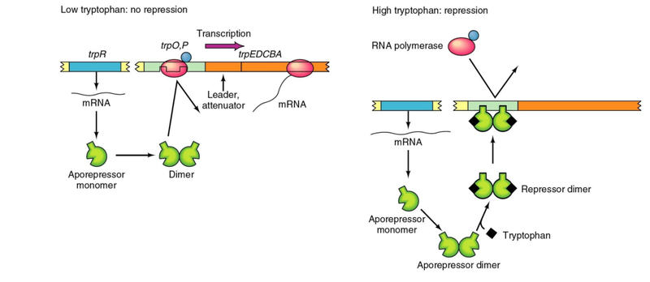

**(2) 衰减作用（Attenuation）：**
- 衰减子（attenuator）是位于结构基因上游的一段DNA区域，可在此发生转录的提前终止。
- 前导RNA转录物可形成两种替代性的茎环结构：终止子结构（3:4茎环）和抗终止子结构（2:3茎环）。
- 前导肽中含有串联的色氨酸密码子，作为色氨酸浓度的传感器。
- **色氨酸充足时：** 核糖体顺利翻译前导肽→形成终止子结构→转录终止。
- **色氨酸缺乏时：** 核糖体在色氨酸密码子处停滞→形成抗终止子结构→转录继续。
- 衰减作用额外控制约**10倍**，两者叠加使总调控幅度达到约**700倍**。

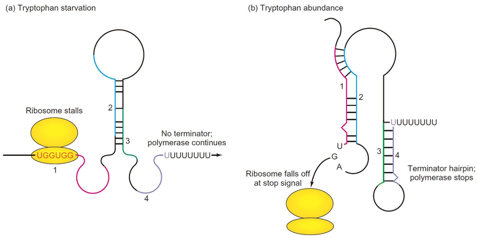

**来源：** MB7-Trascrioption-in-pro-mzhou, 第52-58页

---

### Q21. 大肠杆菌组氨酸合成基因的前导序列含7个连续的组氨酸密码子，有何生物学功能？

**答案：**

**说明：** 该具体问题在课件中未直接涵盖，以下基于色氨酸操纵子衰减机制的课件内容进行类比推理。

组氨酸操纵子前导序列中7个连续的组氨酸密码子的生物学功能是作为**组氨酸浓度的传感器（sensor）**，参与转录衰减（attenuation）调控：

- **当细胞内组氨酸充足时：** 携带组氨酸的tRNA充足，核糖体顺利通过7个组氨酸密码子完成前导肽翻译，促使前导RNA形成终止子二级结构，RNA聚合酶在衰减子处终止转录，结构基因不被表达。
- **当细胞内组氨酸缺乏时：** 携带组氨酸的tRNA不足，核糖体在连续的组氨酸密码子处停滞，改变前导RNA的折叠方式，形成抗终止子结构，阻止终止子发夹结构的形成，RNA聚合酶得以继续转录结构基因，合成组氨酸生物合成所需的酶。

这一机制使大肠杆菌能够根据细胞内组氨酸的水平，快速、精细地调节组氨酸合成酶基因的表达。

**来源（类比依据）：** MB7-Trascrioption-in-pro-mzhou, 第54-58页（Trp操纵子衰减机制）

---

### Q22. 什么是表观遗传（Epigenetic inheritance）？列举两个以上事例

**答案：**

**定义：** "表观遗传学"（Epigenetics）一词由Conrad H. Waddington于1942年提出。当前定义为：表型的变化是可遗传的，但不涉及DNA序列的改变（DNA突变）。即在不改变DNA核苷酸序列的情况下，基因表达发生了可遗传的变化。

**主要机制：** DNA甲基化、组蛋白修饰与染色质重塑、小RNA、朊病毒等。

**事例列举：**

**(1) Agouti小鼠实验：** Agouti基因使小鼠毛色发黄、肥胖且易患癌症。给怀孕母鼠喂食富含甲基供体（如叶酸）的饮食后，甲基供体进入发育中胚胎的染色体，通过增加DNA甲基化水平"关闭"了agouti基因的有害效应。后代小鼠变得瘦小、棕色皮毛，不再易患癌症。母鼠饮食中的BPA（双酚A）暴露则可在错误时间或组织中开启该基因。

**(2) 蜜蜂的皇家饮食与级型分化：** 工蜂和蜂王在遗传上完全相同，但蜂王幼虫被喂食蜂王浆（royal jelly）。蜂王浆中的成分能沉默关键基因Dnmt3，当Dnmt3活跃时幼虫发育为工蜂，当蜂王浆关闭Dnmt3时幼虫发育为蜂王。

**(3) X染色体失活：** 雌性哺乳动物中，两条X染色体中的一条被包装成转录失活的异染色质而沉默，以确保剂量补偿。哪条X失活是随机的，但一旦失活便在该细胞整个生命周期中稳定维持。

**(4) 同卵双胞胎的表观遗传差异：** 幼年同卵双胞胎的表观遗传模式几乎无差异，但年长同卵双胞胎在DNA甲基化和组蛋白乙酰化方面表现出显著差异，影响其基因表达谱。

**来源：** MB16(7), 第17-68页

---

### Q23. 简述蘑菇毒素（α-amanitin）的作用机制

**答案：**

α-amanitin（α-鹅膏蕈碱/毒伞肽）是一种来源于毒蘑菇（Amanita phalloides）的环八肽毒素，其作用机制是对真核生物RNA聚合酶的选择性抑制：

1. **低浓度**时，α-amanitin完全抑制RNA聚合酶II（Pol II）的活性，阻断mRNA前体（hnRNA）的合成。
2. **高浓度**时，α-amanitin也会抑制RNA聚合酶III（Pol III）的活性，影响tRNA、5S rRNA等小RNA的合成。
3. 无论何种浓度，α-amanitin对RNA聚合酶I（Pol I）均无抑制作用，Pol I负责的rRNA合成不受影响。

这一差异性抑制特性使α-amanitin成为研究真核生物三种RNA聚合酶功能的重要工具药物。Roder等人于1974年利用此特性首次区分了三种RNA聚合酶的不同功能。

**来源：** MB8-Transcription in eu-mzhou, 第5-8页

---

# 四、分析/论述题（8题）

### Q24. Griffith（格里菲斯）实验和Hershey-Chase（赫尔希-蔡斯）实验各自是如何证明DNA是遗传物质的？

**答案：**

**Griffith转化实验（1928年，发现转化现象）：**
Griffith使用肺炎链球菌（*S. pneumoniae*）进行实验：S菌株（有毒性，光滑型）能杀死小鼠；R菌株（无毒性，粗糙型）不侵染小鼠。热灭活的S菌株单独也不能感染小鼠。但将热灭活的S菌株与活的R菌株混合注射后，小鼠死亡，且从小鼠体内分离出了活的S型菌株。

**结论：** 热灭活的S菌株中存在着某种"转化因子"（transforming principle），能将无毒的R菌株转化为有毒的S菌株。该实验首次证明遗传物质可以在生物体之间转移。随后Avery等人在1944年通过酶消化实验（用DNase处理后转化能力丧失）进一步证明该转化因子就是DNA。

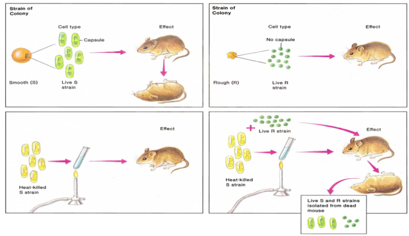

**Hershey-Chase实验（1952年，同位素标记证明DNA是遗传物质）：**
Hershey和Chase使用T2噬菌体感染大肠杆菌：用放射性同位素³⁵S标记噬菌体蛋白质，感染后绝大多数标记的蛋白质留在细菌细胞外；用放射性同位素³²P标记噬菌体DNA，感染后绝大多数标记的DNA进入了细菌细胞内部。

**结论：** 由于噬菌体的遗传物质必须进入宿主细胞才能指导子代噬菌体的产生，而进入细胞的是DNA而非蛋白质，因此DNA（而非蛋白质）是T2噬菌体的遗传物质。该实验独立地、直接地证明了DNA是遗传信息的载体。

**来源：** MB1-2026, 第48-51页

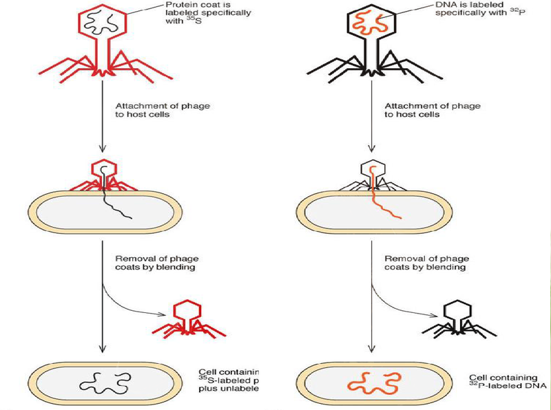

---

### Q25. 什么是telomere（端粒）？简述其三种主要功能。催化端粒合成的酶是什么？

**答案：**

**端粒的定义：** 端粒是存在于真核生物线性染色体末端的特殊结构，由简单的串联重复序列组成。典型的端粒在3'末端含有一条富含G的链，人类端粒重复序列为5'-TTAGGG-3'。端粒对于染色体末端的稳定性是必需的。

**端粒的三种主要功能：**

**1. 保护染色体末端，维持其稳定性：** 端粒蛋白TRF2催化3'端G+T富集链形成t-环（t-loop）结构，通过链入侵使染色体不存在游离的DNA末端，从而将正常的染色体末端与DNA双链断裂区分开来，避免被细胞的DNA损伤修复系统错误识别和修复。

**2. 使端粒能够延伸，解决末端复制问题：** 由于DNA复制不能从染色体的最末端开始，滞后链的合成会导致染色体末端随着每一轮复制而缩短。端粒通过端粒酶的延伸机制补偿这种缩短，维持染色体长度。

**3. 促进减数分裂中同源染色体的配对和重组：** 端粒在减数分裂时通过核膜蛋白与细胞骨架连接，促进同源染色体的配对（pairing）、联会（synapsis）和重组（recombination）。

**催化端粒合成的酶：** 端粒酶（Telomerase），它是一种核糖核蛋白（ribonucleoprotein enzyme），含有自身的RNA模板，本质上是一种逆转录酶（reverse transcriptase）。端粒酶利用染色体3'端G+T链的3'-OH作为引物，以其自身RNA为模板，以迭代方式在染色体3'末端添加串联重复序列。

**来源：** MB3-2026, 第22-27页；MB6-DNA-replication-mzhou, 第36页

---

### Q26. 看图说明Trp操纵子（色氨酸操纵子）内部衰减子的调控原理

**答案：**

色氨酸操纵子的衰减子调控是一种精细的转录水平调控机制，基于前导RNA转录物可形成两种互斥的二级结构。

**结构基础：**
- Trp操纵子结构基因上游存在一段前导序列（leader sequence）。
- 前导RNA包含一个编码短前导肽的开放阅读框，其中含有**两个连续的色氨酸密码子**（关键传感器）。
- 前导RNA可形成两种替代性茎环结构：**终止子结构（3:4茎环）** 和**抗终止子结构（2:3茎环）**。3:4配对形成类似ρ非依赖型终止子的发夹结构，后面接一串U，导致转录终止；2:3配对则阻止3:4终止子发夹的形成。

**当色氨酸浓度高时（Trp充足）：**
1. 细胞内色氨酸-tRNA充足
2. 核糖体顺利通过前导肽中两个连续的色氨酸密码子，快速翻译前导肽
3. 核糖体到达前导肽终止密码子时，占据RNA区域2，导致区域2无法与区域3配对
4. 区域3与区域4配对，形成**终止子发夹结构**（3:4茎环）
5. RNA聚合酶识别该终止信号，转录提前终止，结构基因不表达

**当色氨酸浓度低时（Trp缺乏）：**
1. 细胞内色氨酸-tRNA不足
2. 核糖体在翻译前导肽时，在连续的色氨酸密码子处**停滞**，占据区域1
3. 由于核糖体停留在区域1，区域2被释放，与区域3配对形成**抗终止子结构**（2:3茎环）
4. 区域3已被占用，无法与区域4形成终止子发夹
5. RNA聚合酶顺利通过衰减子位点，继续转录下游结构基因

**调控效果：** 阻遏控制约70倍，衰减额外控制约10倍，总调控幅度达约700倍。

**来源：** MB7-Trascrioption-in-pro-mzhou, 第54-58页

---

### Q27. siRNA和miRNA在生物合成及功能上有什么不同？

**答案：**

| 比较项目 | siRNA | miRNA |
|---------|-------|-------|
| 来源 | 外源性（病毒、转座子或实验引入的长dsRNA） | 内源性（基因组自身编码转录产生） |
| 前体结构 | 长双链RNA（dsRNA），完全互补配对 | pri-miRNA，茎环/发夹结构，内部序列不完全互补 |
| 加工酶 | 仅由Dicer切割产生~21-25nt siRNA | 核内Drosha切割→~70nt pre-miRNA，胞质Dicer再切割为成熟miRNA |
| 作用方式 | 与靶mRNA完全互补配对，导致mRNA切割和降解 | 与靶mRNA不完全互补配对，主要导致翻译抑制；高匹配时也可切割mRNA |
| 作用位置 | 在其产生的位点发挥作用 | 在其他基因组位点发挥作用，可调控多个不同基因 |
| 生物学功能 | 基因组防御——保护基因组免受病毒和转座子侵害 | 内源基因表达的转录后调控；参与发育时序调控、代谢调控等 |
| 放大机制 | 可通过RdRp进行扩增，产生二级siRNA，使沉默效应放大 | 无明显扩增机制 |

**共同点：** 二者都通过RISC发挥功能，均为约21-24nt的小RNA分子，均属于转录后基因沉默（PTGS）机制。

**来源：** MB12(9), 第13页、第28-31页、第38-46页

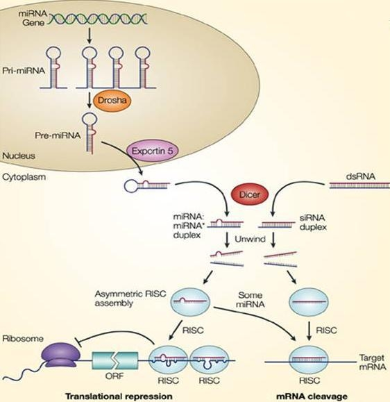

---

### Q28. 假设一种基因（如水稻中的某基因）可被盐分诱导表达，设计实验验证该假设并写出操作步骤

**答案：**

**实验假设：** 水稻中某基因X受盐胁迫诱导表达。

**实验一：实时定量RT-PCR（qRT-PCR）检测**

1. **材料处理：** 选取生长状态一致的水稻幼苗（两叶一心期），分为实验组（200 mM NaCl浇灌）和对照组（正常营养液）。在多个时间点取样（0h、1h、3h、6h、12h、24h），每个时间点3个生物学重复。
2. **总RNA提取与cDNA合成：** Trizol法提取总RNA，DNase I去除基因组DNA，逆转录酶合成cDNA。
3. **实时定量PCR：** 设计跨内含子的特异性引物（避免基因组DNA干扰），选用内参基因（如Actin或Ubiquitin）。配制qPCR反应体系（含SYBR Green I），在实时定量PCR仪上扩增40个循环。
4. **数据分析：** 采用2^(-ΔΔCt)方法计算相对表达量。

   **计算公式：**
   - ΔCt = Ct(目的基因) - Ct(内参基因)
   - ΔΔCt = ΔCt(处理组) - ΔCt(对照组0h)
   - 相对表达量 = 2^(-ΔΔCt)

   **以0h和3h时间点为例（假设数据）：**

   | 样品 | Ct(基因X) | Ct(Actin) | ΔCt | ΔΔCt | 2^(-ΔΔCt) |
   |------|-----------|-----------|-----|-------|------------|
   | 对照0h | 28.5 | 20.0 | 8.5 | 0 | 1.0（基准） |
   | NaCl 3h | 26.0 | 20.2 | 5.8 | -2.7 | 2^(2.7) ≈ **6.5** |

   **解读：** NaCl处理3h后，基因X的相对表达量是对照0h的6.5倍，说明盐胁迫诱导了基因X表达。其余时间点同理计算。用t-test或ANOVA分析显著性。
5. **预期结果：** 若基因X受盐诱导，实验组中表达量应在盐处理后显著升高，且呈时间依赖性。

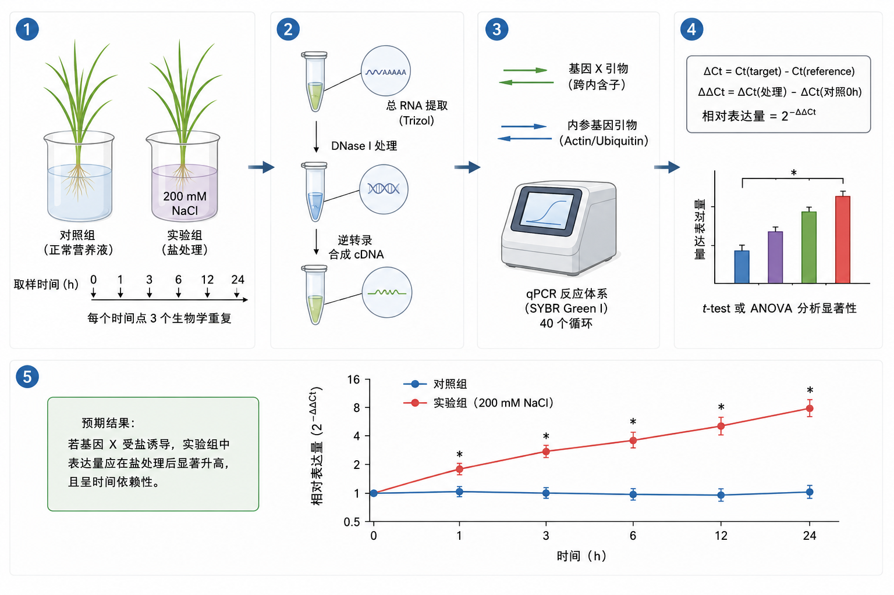

**实验二：Northern Blot验证（可选）**
提取RNA进行甲醛变性琼脂糖凝胶电泳，转膜后用标记的特异性探针杂交，以看家基因为上样对照。

**实验三：启动子融合报告基因验证（可选）**
克隆基因X的启动子与GUS/GFP融合，农杆菌介导转化水稻，盐处理后检测报告基因的表达，确定该基因在哪些组织中被诱导表达。

**来源：** MB4-2026, 第25-33页（qRT-PCR原理、2^(-ΔΔCt)方法）；MB4-2026, 第94-96页（Northern Blot）；MB5-2026, 第2-4页（启动子融合报告基因）

---

### Q29. 已知exon 1、2、3、4长度分别为500、200、200、300bp，exon2存在可变剪接，可能产生1-2-3-4和1-3-4两种转录本。计算长度并设计实验验证

**答案：**

**转录本长度计算：**
- 转录本1（1-2-3-4）：500 + 200 + 200 + 300 = **1200 bp**
- 转录本2（1-3-4）：500 + 200 + 300 = **1000 bp**
- 两者相差200 bp（正好是exon2的长度），可通过凝胶电泳明显区分。

**实验设计方案：**

**原理：** 设计跨越可变剪接区域的PCR引物，通过RT-PCR扩增后进行凝胶电泳，根据产物大小区分不同转录本。

**步骤：**
1. **引物设计：** 在exon 1的5'端设计正向引物，在exon 4的3'端设计反向引物。确保引物跨过可变剪接区域（跨exon 2），使两种转录本都能被扩增出可区分大小的产物。
2. **RNA提取与cDNA合成：** 提取该基因表达组织的总RNA，DNase I处理后，用逆转录酶合成cDNA。
3. **PCR扩增：** 以cDNA为模板，用设计的跨外显子引物进行PCR。同时以基因组DNA为模板做对照（基因组产物会包含内含子，大小更大）。
4. **凝胶电泳检测：** PCR产物进行2%琼脂糖凝胶电泳，用DNA Marker比对。
5. **结果判断：** 若存在两种转录本，电泳胶上将出现两条带：约1200 bp和约1000 bp。可通过条带亮度半定量判断相对丰度。
6. **验证（可选）：** 切胶回收两种PCR产物，Sanger测序验证exon 2是否被包含。

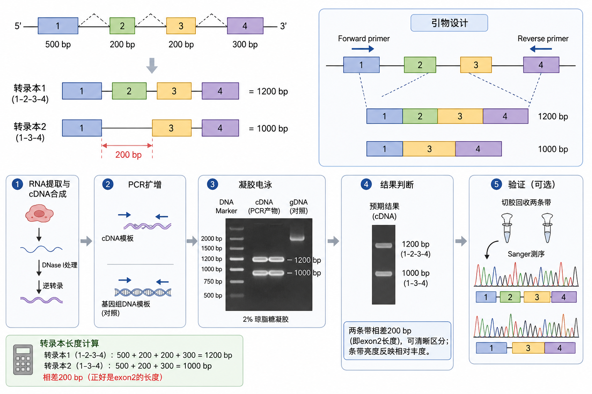

**来源：** MB4-2026, 第19-27页（PCR与RT-PCR）；MB4-2026, 第2-7页（凝胶电泳）

---

### Q30. 已知一段cDNA可能包含300bp的内含子（由RNA可变剪接所致），设计实验判断其是否含该内含子

**答案：**

**设计原理：** 利用内含子在基因组DNA中存在而可能在cDNA中被剪接去除的差异，通过PCR比较扩增产物大小来判断cDNA中是否含有该内含子。

**实验步骤：**

1. **引物设计：** 在该cDNA上、跨越候选内含子区域的两侧外显子区域分别设计正向和反向引物。引物结合位置位于候选内含子两侧的外显子上。
2. **模板准备：** 实验组：提取RNA，DNase I处理后逆转录获得cDNA。对照组：提取同一样品的基因组DNA。
3. **PCR扩增：** 以cDNA和基因组DNA分别为模板，使用同一对引物在相同条件下平行扩增。94℃变性、50-60℃退火、72℃延伸，30-35个循环。
4. **琼脂糖凝胶电泳分析：** 将cDNA和基因组DNA的PCR产物在同一凝胶中电泳，加入DNA Marker。比较两条泳道中条带的大小。
5. **结果判断：**
   - 基因组DNA泳道：条带较大（= 两侧外显子长度 + 内含子长度）。
   - 若cDNA含该内含子：cDNA条带大小与基因组DNA一致（或接近），比不含内含子时大300 bp。
   - 若cDNA不含该内含子：cDNA条带比基因组DNA小300 bp（仅两侧外显子长度之和）。
   - 若cDNA泳道出现两条带：说明存在两种剪接变体（可变剪接）。
6. **验证（可选）：** 切胶回收各条带测序，确认内含子边界序列是否符合GT-AG规则。

**来源：** MB4-2026, 第19-27页（PCR与RT-PCR）；MB4-2026, 第2-7页（凝胶电泳）

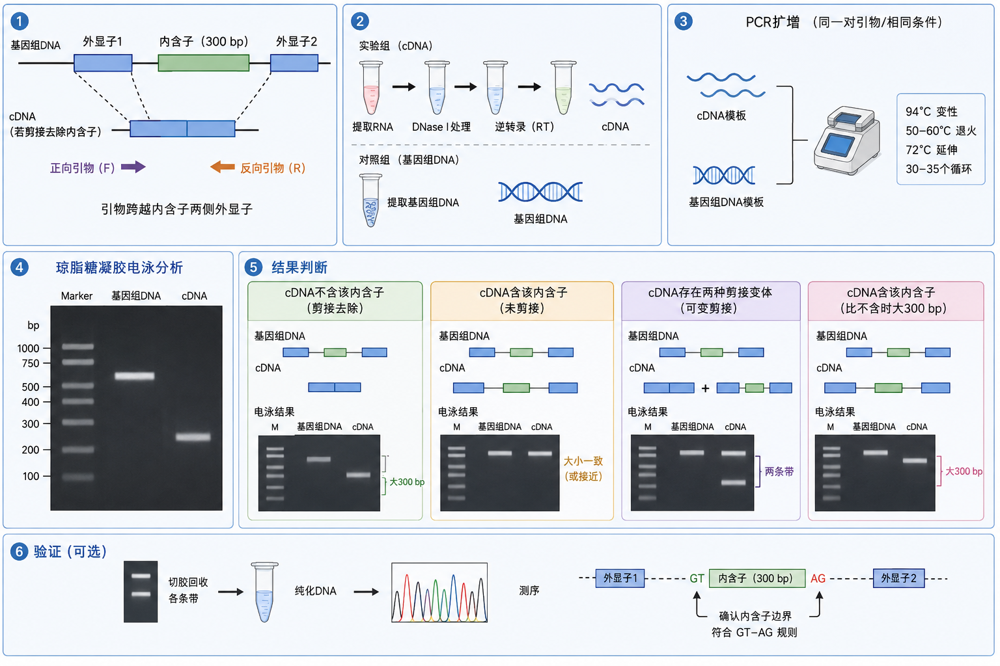

---

### Q31. 给定X质粒（含Sal I, Xho I, BamH I位点）和Y基因（两端含Sal I, BamH I位点，基因内部含一个Sal I位点），选择内切酶并简述同尾酶的使用原理，以及如何避免酶切错误

**答案：**

**一、问题分析：** X质粒可用酶切位点：Sal I、Xho I、BamH I。Y基因末端含Sal I和BamH I位点。**关键问题：** Y基因内部还含有一个额外的Sal I位点，因此不能直接使用Sal I切割Y基因（否则会将基因切成两段）。

**二、解决方案：**
- **Y基因：** 使用 **Xho I + BamH I** 双酶切。用Xho I代替Sal I。
- **X质粒：** 使用 **Sal I + BamH I** 双酶切。

**原理——同尾酶（Isocaudomers）：** 同尾酶是指来源不同、识别序列不完全相同、但切割DNA后产生相同（或兼容）粘性末端的一些限制性内切酶。Sal I和Xho I是一对同尾酶——虽然识别不同的核苷酸序列，但切割后都能产生兼容的单链突出粘性末端（compatible cohesive ends），可通过碱基互补配对结合，在T4 DNA连接酶作用下形成磷酸二酯键。

**三、操作步骤：**
1. 用Xho I和BamH I双酶切Y基因——基因内部的Sal I位点不被切割。
2. 用Sal I和BamH I双酶切X质粒使其线性化。
3. 将酶切后的Y基因与线性化X质粒混合，T4 DNA连接酶连接。Y基因的Xho I末端与X质粒的Sal I末端（同尾酶兼容末端）互补配对；BamH I末端与BamH I末端互补配对。连接后的重组位点无法再被Sal I或Xho I切割。
4. 将连接产物转化入大肠杆菌感受态细胞，涂布抗生素平板筛选阳性克隆。

**四、如何避免酶切错误：**
1. **检查基因序列：** 实验前通过序列分析确认基因内部是否含有所用酶切位点。
2. **使用同尾酶策略：** 当基因内部有所选酶切位点时，改用同尾酶代替。
3. **碱性磷酸酶处理：** 对酶切后的载体去除5'-磷酸基团，防止载体自连。
4. **定向克隆：** 使用两种不同的限制性内切酶，产生不同粘性末端，确保基因以正确方向插入。
5. **设置对照：** 设置载体自连对照、单酶切对照等，评估酶切和连接效率。
6. **酶切验证与测序：** 对阳性克隆提取质粒进行酶切鉴定，最终测序确认插入序列的正确性。

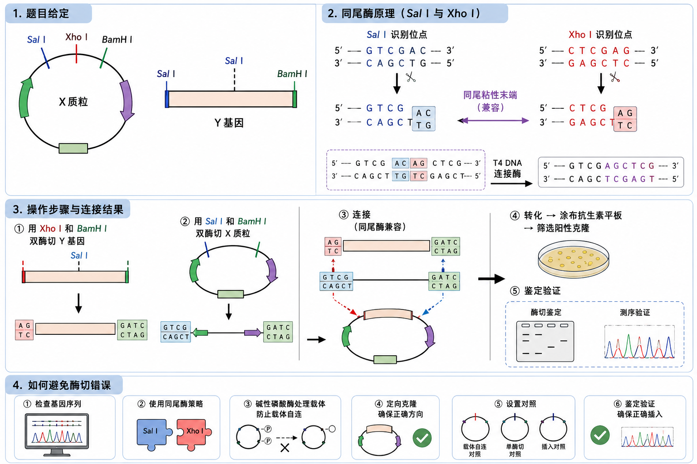

**来源：** MB4-2026, 第34-42页（限制性内切酶类型、粘性末端与平末端、同尾酶概念）；MB4-2026, 第43页、第58页（重组DNA构建步骤、碱性磷酸酶防止自连）；MB4-2026, 第65页（定向克隆原理）
